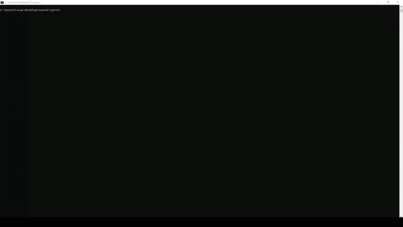

# NoiseCloud Lite

```text
    _   __      _              ________                 __
   / | / /___  (_)____ ___    / ____/ /___  __  ______/ / 
  /  |/ / __ \/ / ___/ _ \  / /   / / __ \/ / / / __  /   
 / /|  / /_/ / (__  )  __/ / /___/ / /_/ / /_/ / /_/ /    
/_/ |_/\____/_/____/\___/  \____/_/\____/\__,_/\__,_/     
```

O NoiseCloud Lite é uma ferramenta de Esteganografia em Vídeo. Ele permite esconder arquivos de qualquer formato dentro de vídeos comuns, utilizando os pixels dos frames como armazenamento binário.

Esta versão Lite foca na facilidade de uso, performance e interface interativa, priorizando a velocidade e a resiliência dos dados.

---

## Funcionalidades

- Aceleração por Hardware: Suporte nativo para encoding via GPU (NVIDIA NVENC, AMD AMF, Intel QSV).
- Interface Interativa: Menu simples e guiado no terminal (TUI).
- Compressão Inteligente: Compactação automática via Gzip antes de esconder os dados.
- Resiliência (ECC): Implementação de correção de erros para garantir a integridade dos arquivos recuperados.
- Multi-threading: Processamento paralelo para máxima velocidade no seu processador.

---

## Pré-requisitos

Para rodar o NoiseCloud Lite, você precisa apenas de:

1.  FFmpeg: Essencial para a manipulação de vídeo.

> [!TIP]
> Dica de Instalação no Windows:
> Se você não tem o FFmpeg, abra o PowerShell como Administrador e cole o comando abaixo:
> ```powershell
> winget install -e --id Gyan.FFmpeg
> ```

---

## Como Usar

Basta executar o comando abaixono cmd (precisa estar dentro da pasta):

```bash
ncc
```

No menu interativo, você terá as seguintes opções:



1.  ENCODE (Esconder Arquivo): Selecione o arquivo que deseja camuflar e o nome do vídeo de saída.
2.  DECODE (Recuperar Arquivo): Aponte para um vídeo criado pelo NCC e recupere o arquivo original.
3.  SAIR: Fecha o programa de forma graciosa.

(O arquivo que será processado deverá estar no mesmo diretório do ncc.)
---

## Notas Técnicas

- Esteganografia: Os dados são convertidos em padrões visuais em cada frame do vídeo.
- Redundância: O sistema reserva espaço para metadados e correção de erros, garantindo que mesmo com pequenas distorções de vídeo, seus dados permaneçam intactos.
- Formato: O padrão de saída é .mp4 com preset de alta qualidade (hq) para evitar perda excessiva de dados por compressão de vídeo comum.

---

## Contribuição

Contribuições são sempre bem-vindas! Sinta-se à vontade para abrir uma Issue ou enviar um Pull Request.

---
*NoiseCloud Lite*
